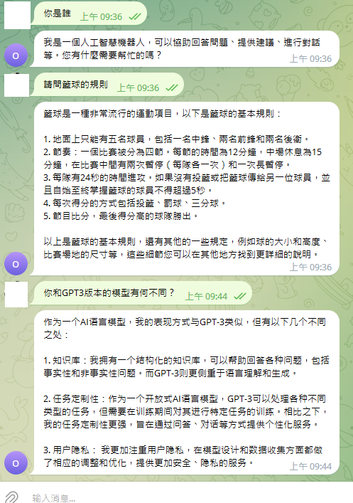
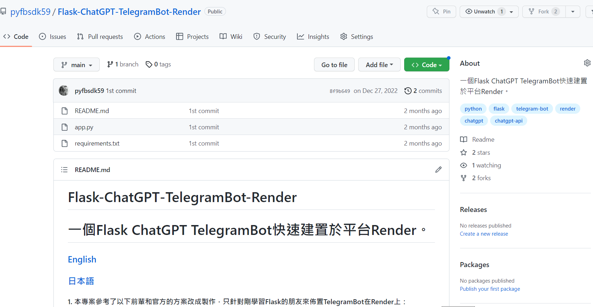
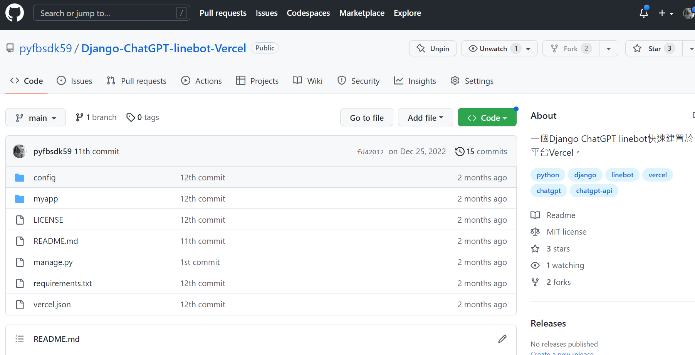
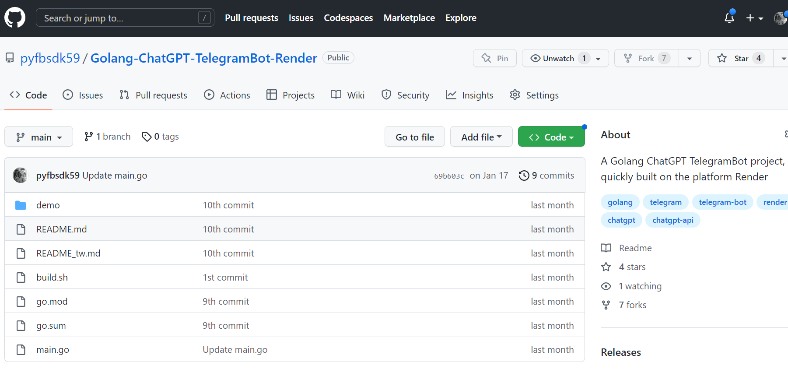
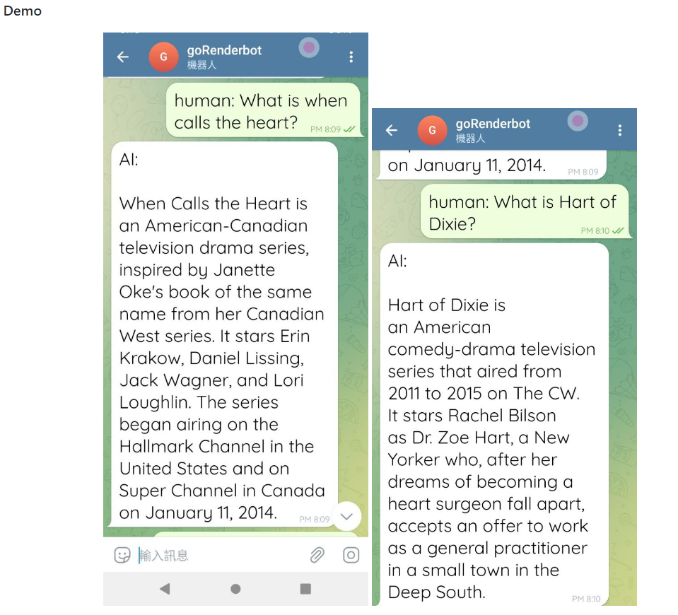
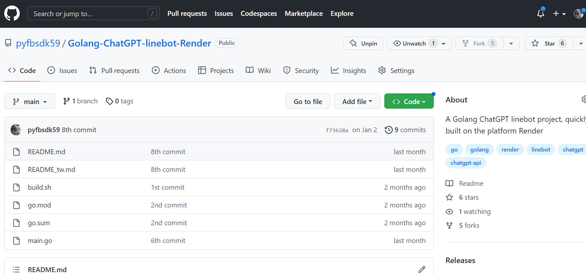
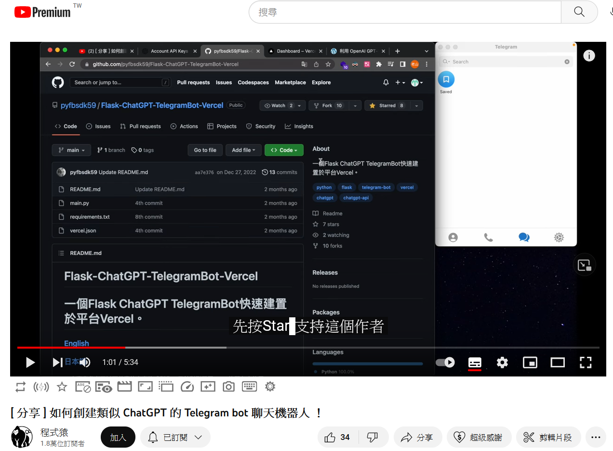
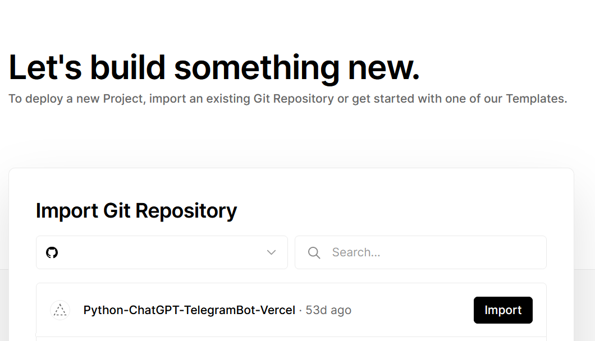
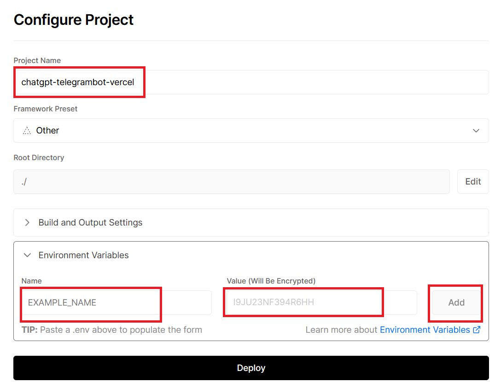

# Flask-ChatGPT-TelegramBot-Vercel
# 一個使用Flask框架和GPT3模型官方API，創造一個TelegramBot，快速建置於平台Vercel。

## [TelegramBot Vercel GPT3.5 turbo/ChatGPT版本部屬](https://github.com/pyfbsdk59/Flask-official-ChatGPT-TelegramBot-Vercel)

  

## [TelegramBot Render GPT3版本部屬](https://github.com/pyfbsdk59/Flask-ChatGPT-TelegramBot-Render)

  

## [LineBot Django Vercel GPT3版本部屬](https://github.com/pyfbsdk59/Django-ChatGPT-linebot-Vercel)

  

## [TelegramBot Golang Render GPT3版本部屬](https://github.com/pyfbsdk59/Golang-ChatGPT-TelegramBot-Render)

  

  

## [LineBot Golang Render GPT3版本部屬](https://github.com/pyfbsdk59/Golang-ChatGPT-linebot-Render)

  

### [English](https://github.com/pyfbsdk59/Flask-ChatGPT-TelegramBot-Vercel/blob/main/README_en.md)
### [日本語](https://github.com/pyfbsdk59/Flask-ChatGPT-TelegramBot-Vercel/blob/main/README_jp.md)

#### 0. 程式猿影音教學參考。請支持且訂閱加按讚感謝他的辛勞。

https://www.youtube.com/watch?v=eKKEa6NhCd0

  

#### 1. 本專案參考了以下前輩的方案改成製作，只針對剛學習Flask的朋友來佈置TelegramBot在Vercel上：

https://github.com/howarder3/GPT-Linebot-python-flask-on-vercel  
https://github.com/zaoldyeck/telegram-innovation-chatbot/tree/basic

#### 2. 本專案因部屬在Vercel上，所以程式碼和Docker版本不同，也必須使用Flask和設定webhook。設定webhook請參考。

https://zaoldyeck.medium.com/%E6%89%8B%E6%8A%8A%E6%89%8B%E6%95%99%E4%BD%A0%E6%80%8E%E9%BA%BC%E6%89%93%E9%80%A0-telegram-bot-a7b539c3402a

#### 3. 註冊Vercel帳號後，import已經fork過來的本專案。

  

#### 4. 必須在Vercel的Environment Variables設定兩個環境變數，分別是OPENAI_API_KEY和TELEGRAM_BOT_TOKEN。順便記下Vercel給的網址，可以自己縮短一些。

  

#### 5. 打開瀏覽器，輸入以下網址，設定webhook為部屬完Vercel的最後步驟，格式為：https://api.telegram.org/bot{$token}/setWebhook?url={$webhook_url}。

##### 故實際範例就像以下範例（非直接複製使用，請改用自己的telegram token和Vercel專案的URL）：

https://api.telegram.org/bot606248605:AAGv_TOJdNNMc_v3toHK_X6M-dev_1tG-JA/setWebhook?url=https://xxx.vercel.app/callback

#### 6. 成功後會顯示以下文字：

{
  ok: true,
  result: true,
  description: "Webhook was set"
}
------
### 創建Telegram機器人和取得token，請參考： 
https://ithelp.ithome.com.tw/articles/10245264  
https://tcsky.cc/tips-01-telegram-chatbot/

